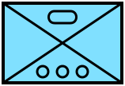

# Milsymbol-py

(**NOTE: This is a port of [milsymbol.js](https://github.com/spatialillusions/milsymbol) to Python**, done using [Antigravity](https://antigravity.google/) with Gemini 3.0 Pro. There are likely still bugs; see below on my thoughts about this port.)

Milsymbol-py is a small library in pure Python that creates military unit symbols according to MIL-STD-2525 and STANAG APP-6.

Example usage:

```python
from milsymbolpy import Symbol
stryker_sidc = "130310000012110007061100000000"
symbol = Symbol(stryker_sidc)
svg_content = symbol.as_svg()
symbol.as_png(png_path)
```



A more complex example:

```python
from milsymbolpy import Symbol
heavy_mg_sidc = "130315003611010300000000000000"
options = {
    "size": 35,
    "quantity": 200,
    "staffComments": "FOR REINFORCEMENTS",
    "additionalInformation": "ADDED SUPPORT FOR JJ",
    "direction": (750 * 360) / 6400,  # 750 Mils to Degrees
    "type": "MACHINE GUN",
    "dtg": "30140000ZSEP97",
    "location": "0900000.0E570306.0N",
}
symbol = Symbol(heavy_mg_sidc, options)
svg_content = symbol.as_svg()
symbol.as_png(png_path)
```


Compare this to the reference figure from MIL-STD-2525C:


## Milsymbol-py summary

Milsymbol-py supports a lot of different options:

- NATO or US standards (MIL-STD-2525C, MIL-STD-2525D, MIL-STD-2525E, FM 1-02.2, STANAG APP-6 B, STANAG APP-6 D, STANAG APP-6 E)
- Filled/unfilled symbols
- Framed/unframed symbols
- Text fields
- Movement indicators
- SVG/Canvas output (using SVG or Canvas draw instructions)
- Outlines of symbols
- and much more...

Since version 3.0 of [Milsymbol.js](https://github.com/spatialillusions/milsymbol), symbology will be rendered as closely as possible to MIL-STD-2525E / STANAG APP-6 E / FM 1-02.2 as possible, even if the symbol might look slightly different in older standard documents. This is to make symbology uniform between systems that use different versions of the SIDC codes. In some cases where symbols are inconsistent between different appendixes in the standard documents, they have been made consistent for easier interpretation.

## Getting started

Download/clone the source and `pip install ./path/milsymbol-py`.  During development of your project, I recommend doing an editable install with `pip install -e ./path/milsymbol-py`.

To create your first symbol, you use the symbol method to create a symbol object:

```python
from milsymbolpy import Symbol
sym = Symbol(sidc,{options})
```

To make a symbol for an infantry platoon, the syntax would be:

`sym = Symbol("130310001412110000000000000000")`

And `sym` will now be a symbol object containing information about the size and draw instructions.

You can get an image in either SVG or PNG formats.

`svg = sym.as_svg()`

`png = sym.as_png(dest_path)`

And if you don't want to make it step by step, you can chain it all together like this:

`var canvasElement = new ms.Symbol("130310001412110000000000000000").asCanvas();`


## Thoughts on "vibe-coding" the port

This port was done using [Antigravity](https://antigravity.google/) and Gemini 3.0 Pro.  

>"I found that Antigravity was able to generate a lot of the code, but it was not able to generate the correct code for the SVG paths.  I had to manually edit the code to get it to work."

(That last sentence was a code-completion suggewtion made by Antigravity based on the session history.  It's pretty accurate!)

The biggest problem was with Gemini porting the very large files like [ground.py](milsymbolpy/iconparts/ground.py) due to an output token limit of 4096 tokens. This was because Antigravity was in preview status when milsymbol-py was ported; this limit will be fized in future versions. I ended up porting the very large files manually and let Gemini do the rest.

There were numerous other smaller problems:

* Though told to port the entire javascript code base, it had to be reminded to include various chunks of functionality.
* It frequently wrote small throw-away evaluation scripts in the root directory, but did not clean them up until told to.
* Unless instructed, it often did not actually evaluate the correctness of the resulting image, even though it claimed to.  This most often occurred when it missed a sector 1 or sector 2 modifier but was absolutely convinced it had included it.

In general, even though Antigravity was using Gemini 3.0 Pro, it had a lot of problems that I have *not* seen when using it at gemini.google.com to do code generation.

## References

- [Milsymbol](https://github.com/spatialillusions/milsymbol)
- [Milsymbol Documentation](https://spatialillusions.com/milsymbol/)
- [MIL-STD-2525C/D/E](docs/)
- [FM 1-02.2 Military Symbols][docs/]

See [here](https://quicksearch.dla.mil/qsDocDetails.aspx?ident_number=114934) to download all revisions of MIL-STD-2525.

## Contact

Milsymbol is created and maintained by Måns Beckman.

- http://www.spatialillusions.com

Milsymbol-py is created and maintained by [stephen-riley](https://github.com/stephen-riley).

## Licensing

MIT, See [LICENSE](https://github.com/spatialillusions/milsymbol/LICENSE) for details.

If you like Måns Beckman's work and would like to support it, please use https://buymeacoffee.com/spatialillusion
